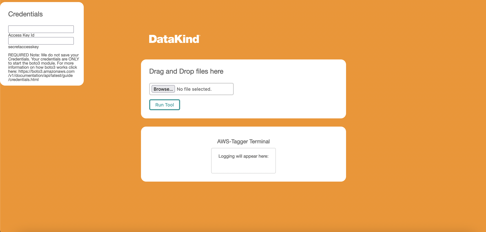

# Flask-Aws-Tagger

Website: https://aws-tagger.datakind.org



## Features:

1. Built in websocket functionatily for flask web app.
2. Wraps Newest version of Datakind's AWS-Tagger into a flask webapp

For instructions on installing aws-tagger only click on this link: https://github.com/datakind/aws-tagger/tree/main/tagger

---

# What is Flask-Aws-Tagger?

Its a Webapp designed to help bulk tagging of different resources. The Tag editor from the aws websconsole lets you download csv files of your different resources but it doesn't let you upload csv files; this webapp does just that. (STILL WIP, USE Aws-Tagger cli for now in https://github.com/datakind/aws-tagger/tree/main/tagger)

## Running Flask-aws-tagger on Docker locally

### Prerequisites

Docker

### How to build the Docker Environment

Step1

```
git clone https://github.com/datakind/aws-tagger.git
cd "aws-tagger"
```

Step 1a (FOR MAC m1)

```
export DOCKER_DEFAULT_PLATFORM=linux/arm64
NOTE - IF YOU DON'T RUN THIS COMMAND THE WEBSOCKET WILL NOT WORK ON MAC M1
```

Step 2

```
docker build . -t aws-tagger
docker run -p 5000:5000 -t aws-tagger
```

Step 3

Go your browser and type:

```
http://localhost:5000
```

## How to use

Enter your access_key_id, secret_key, and region you want to use. (if you don't choose a region, you can only use csv upload and your csv upload must contain the same region column that you get from the tag editor in aws web console. )
